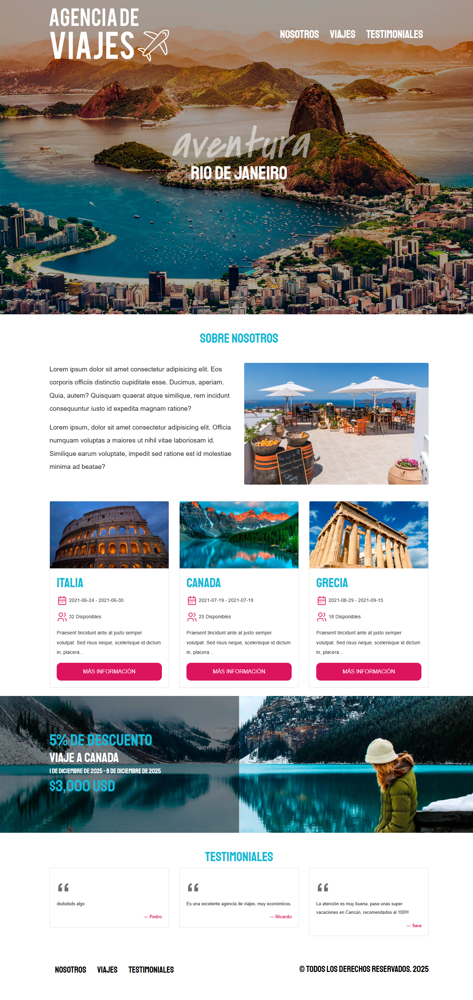
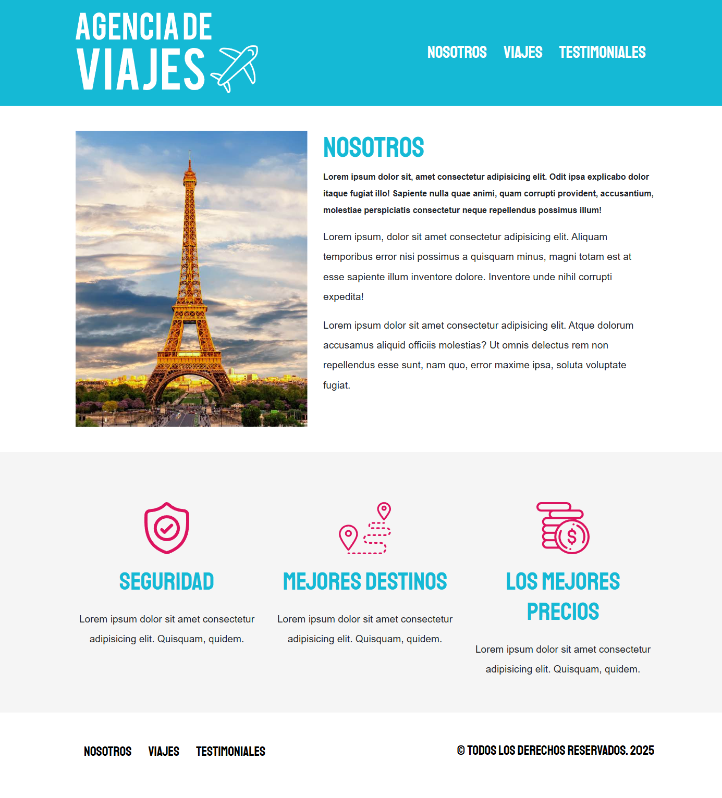
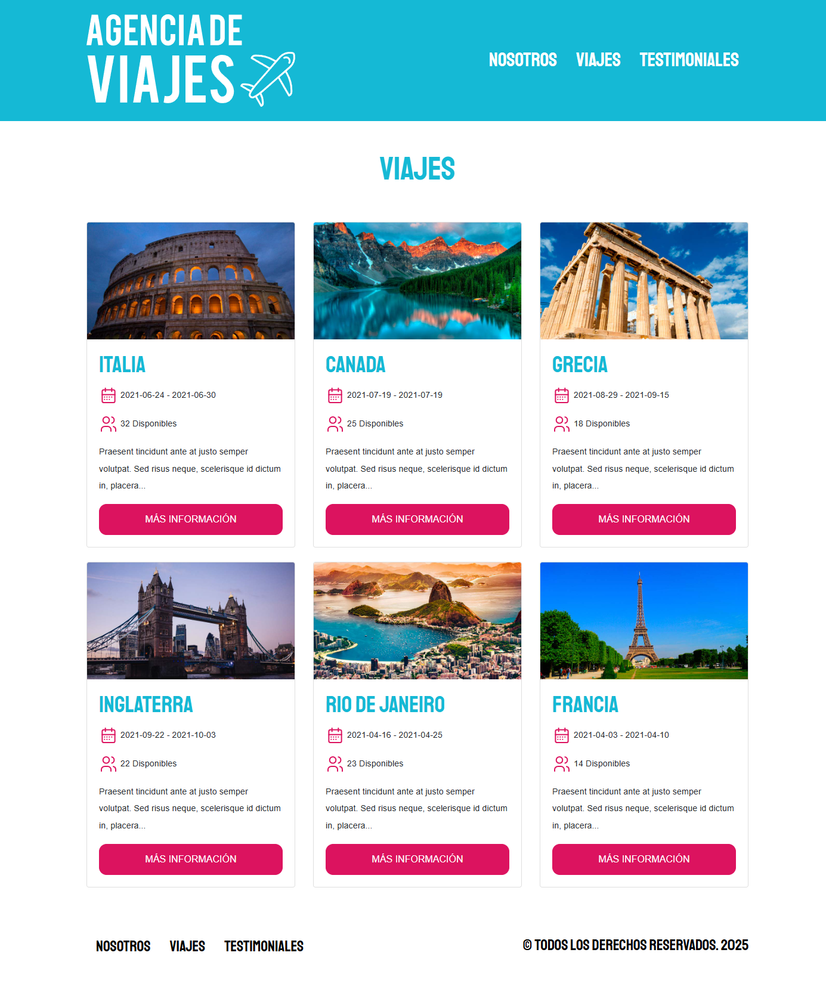
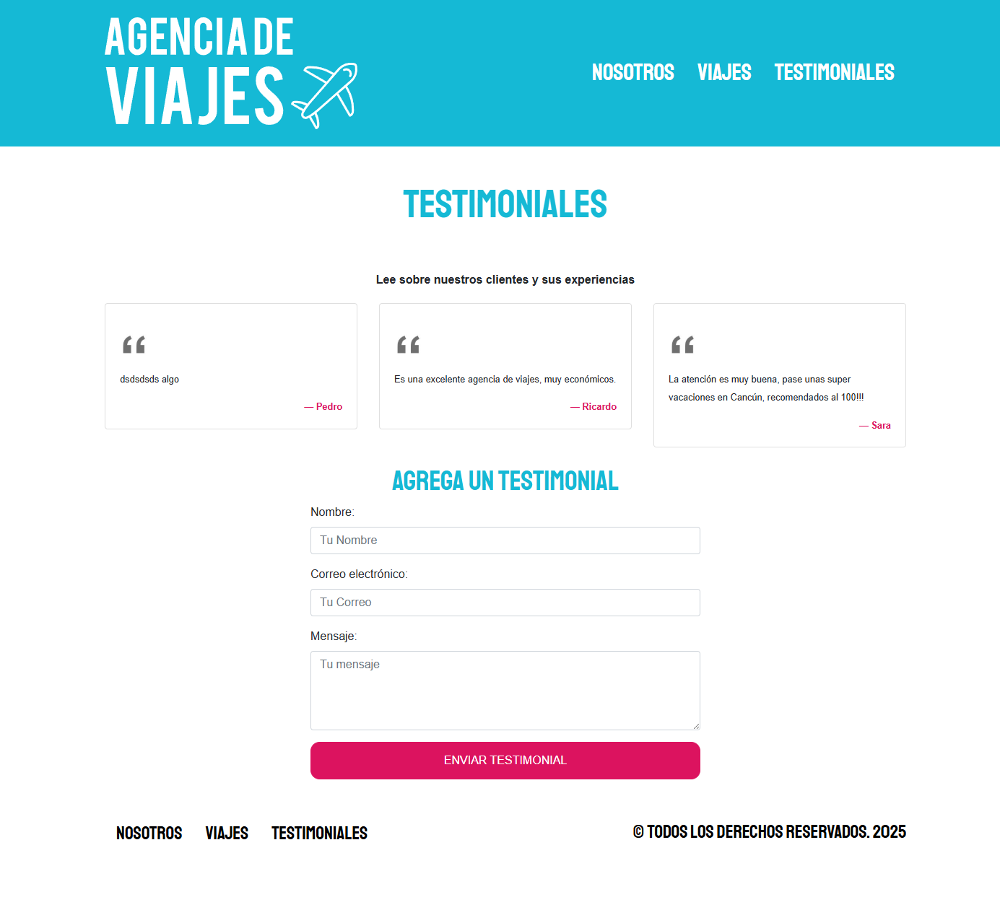

# Agencia Viajes Node:

Página pequeña de una Agencia de Viajes, para aplicar y aprender conceptos básicos de Express, PUG, Sequelize.

Tiene las siguientes características:

- Página de inicio (Menú especial para el home, sección Hero, sección "sobre nosotros", sección listado de viajes limitada a 3, sección bono promo, sección listado testimoniales limitado a 3, footer).
- Página de "Nosotros".
- Página de listado de viajes.
- Página de detalle de un viaje.
- Página de listado de testimonios, con formulario de creación de testimonio.
- Utiliza Bootstrap para los estilos.
- Servidor de NodeJS con "Express".
- Utiliza PugJS como template engine.
- Utiliza Sequelize como ORM.
- Base de Datos MySQL.
- Arquitectura MVC.
___

## Node

Para **desarrollo**: 

1) Instalar dependencias.
2) Crear archivo ".env" con las siguientes variables de entorno:

```
BD_NOMBRE=nombrebd
BD_USUARIO=usuariobd
BD_PASSWORD=passwordbd
BD_HOST=localhost
BD_PORT=3306
```

3) Correr servidor con:

```
npm run dev
```
___

Para **producción**: 

1) Repetir pasos 1 y 2 de desarrollo.

2) Correr servidor con:

```
npm run start
```
___

## Screenshots

**Home**

**Nosotros**

**Viajes**

**Testimoniales**
